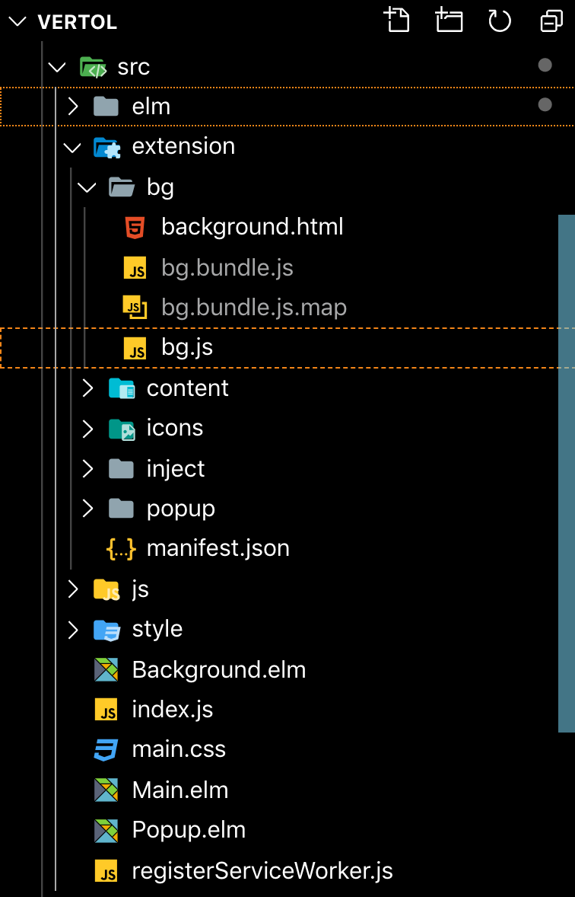

First let’s start with a bit of background.

I got a job as an Elm developer winter 2018.

At the time I didn’t know Elm so I had to learn in a hurry.

I had the idea for a chrome extension than can update the images I use on a website or app. But to go along with the chrome extension I had to build a whole dashboard (which I’ll write more about that later).

Over the next weeks and months I built and rebuilt the app I call [Vertol](https://tryvertol.com).
I learned how to build an Elm application by reverse engineering our app at work, as well as looking over [Richard Feldman's SPA](https://github.com/rtfeldman/elm-spa-example) app  and a number of other tutorials.

Researching "how to build a chrome extension in Elm" didn’t yield much besides "[danneu/elm-chrome-extension: a chrome extension composed of three elm apps that synchronize a single model](https://github.com/danneu/elm-chrome-extension)". Looking at how [danneu](https://github.com/danneu) structured their extension helped a lot with getting something set up. I took a lot of inspiration from danneu. I ended up needing all 3 main components of a chrome extension. A background script, popup script and content script. I have seperate webpack configs for the dashboard and the extension.

I'm trying to keep all the business logic in Elm, and pass messages out through ports as needed. It's still very much a work in progress but I'm pretty happy with how things have turned out.

If you're familiar with ports, it's not too difficult to get working. Following a similar set up as [Murphy Randle's pattern](https://www.youtube.com/watch?v=P3pL85n9_5s) of working with ports, I was able to connect the chrome runtime with the different parts of the extension. It seems to "scale" pretty well. So everything you already know about ports makes working with Chrome a piece of cake. It's not too dissimilar to Elm's ports.

My directory structure is a little different than danneu though.



The `Main.elm` you see is for the dashboard application.

The source code for the chrome extension shares code with Vertol’s dashboard. So to make things easy I just have the whole source for the extension inside the `src` folder, `manifest.json` and all, and I just simply `gitignore` the compiled output.

```
package.json
"build-ext-prod": "webpack --config config/webpack.ext.js && npm run zip-ext",
"zip-ext": "zip -r vertol.zip src/extension"
```


```
// webpack.ext.js config 
 entry: {
    popup: paths.extPopupJs,
    bg: paths.extBGJS,
    content: paths.extContentJS,
  },

  output: {
    pathinfo: true,
    // The build folder.
    path: paths.appSrc,
    filename: 'extension/[name]/[name].bundle.js',
    publicPath: publicPath,
    chunkFilename: '[name].bundle.js',
    ...more config
  },
 ```

Then a build script `npm run build-ext-prod` packages it so it's ready to load in a browser.

I'm including the source code as a gist because the whole source is private for now. 

#### How the extension is built:

- `src/extension/`

  - [`/bg/bg.js`](https://gist.github.com/imdwit/e9ac44f6341460ee24262c801399254c)

        - handles connecting the `Background.elm` to the chrome runtime
        - adds images to the "staging" area passed to it from the content script
        - "seeds" assets to the content script when a user has images in the "staging" area
        - requests a signed url for uploading to s3
        - coordinates injecting the content script

  - [`/popup/init.popup.js`](https://gist.github.com/imdwit/9ae109eb3a4a57f73fe5c7a9bbc4700f)
        - connects the Popup to the the background script
        - handles log in
        - sets up message handlers to connect the `Popup.elm` model to the chrome runtime
        - when a user opens the popup from the chrome extension it asks for the `Popup` model from `Background.elm`

  - [`/content/content.js`](https://gist.github.com/imdwit/5e6f28fdccf45bbffe21a2e97014506b)
        - responsible for injecting some css and adding event handlers to enable drag and drop of new images
        - when an image is selected it is base64 encoded and passed to `Background` to cache in what I call a ‘staging’ area
        - when a user hits save the image is uploaded to s3 and updated ion the DB

* [`src/Background.elm`](https://gist.github.com/imdwit/24e3e48c8a8d31bcfaba4dfb2e43c2e2)

  `Background.elm` and `bg.js` are the brain, it persists the state for Popup.model, and handles the xhr requests. Passing messages back and forth between the popup, as well as the content scripts. Im taking advantage of Elm's `Platform.worker` since there's no DOM.

```
-- Background model
type alias Model =
    { popUp : PopUp.Model
    , hostname : String
    , projects : List Project
    , staging : Dict String Asset.Preview
    }
```

- [`src/Popup.elm`](https://gist.github.com/imdwit/afc9c0bd03254cb1605db6c61e5652a7)

  Popup lets you log in (more features coming soon), and passes that data to background, so it can check if you own this site/app to enable the content scripts.
  Being that chrome extension popups are effectively stateless, every time you open the popup it has to reinit the app. So storing the state of `Popup`’s model in `Background` makes it super simple to pass the model in as flags. When Popups model changes, it gets passed to Background so the next time the popup is open it’s initialized with the right state.

After you login and it registers the fact that the website you’re on is one of your projects. The content scripts wire up the event handlers for updating your images. It registers drop events on the `` tags to enable drag and drop. When an image file is selected it is then base64 encoded and passed to `Background` where it can remain cached in its model (seen above)

`{staging : Dict String Asset.Preview}`

So in the event a user accidentally refreshes, or navigates away from the page, the user doesn’t have to reselect new images, and they can just hit save to upload the replacements.When a user hits ‘save’, Background requests a signed url from the api for a PUT request for the S3 bucket where images are stored. The image is uploaded, and progress events are sent to the content script to increment a progress bar on the image.

`Popup` and `Background` are essentially independent elm applications that send messages out through _elm_ ports to the chrome runtime’s ports.

- `src/extension/content/content.js`

  The content script first injects some css to style the buttons and progress bars for new images. The script finds all the images by using the [attribute selector](https://developer.mozilla.org/en-US/docs/Web/CSS/Attribute_selectors) `'[src*="imgix.net"]'`. This selector finds all images stored in Vertol's cdn provider. After finding the images it adds drag and drop event handlers to them to handle showing previews and uploading new replacements.
  `content.js` also uses `chrome.extension.sendMessage` to send messages to `chrome.runtime.onMessage.addListener` in [`bg.js`](https://gist.github.com/imdwit/e9ac44f6341460ee24262c801399254c). For instance there’s an `addFileToStaging` message that puts the base64 encoded image into `Background.elm`’s staging `Dict`.
  When a new image is selected the image is replaced inline with a base64 encoded version, but not yet saved. The user has the option to undo selecting that image, which puts the image back how they found it. Or they can hit ‘save’ which dispatches an `upload` event to `bg.js` which then uploads the image to S3. Content then receives progress events to update the progress bar’s value to indicate to the user something is happening.

Thanks for checking out this quick tour of my chrome extension. I learned a ton making it and hope to improve upon it in the near future. If you have any questions feel free to reach out to [me on twitter.](https://twitter.com/iamdwit)
